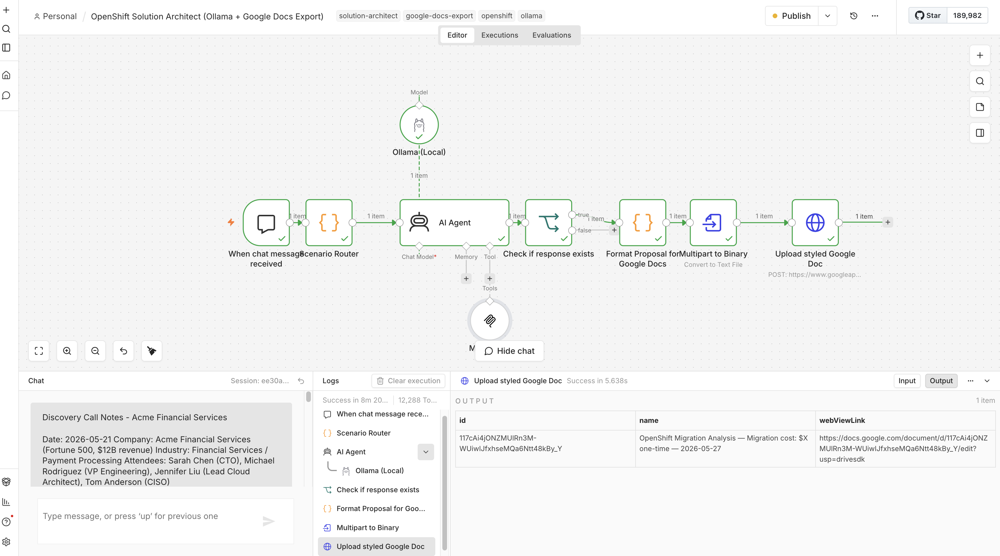
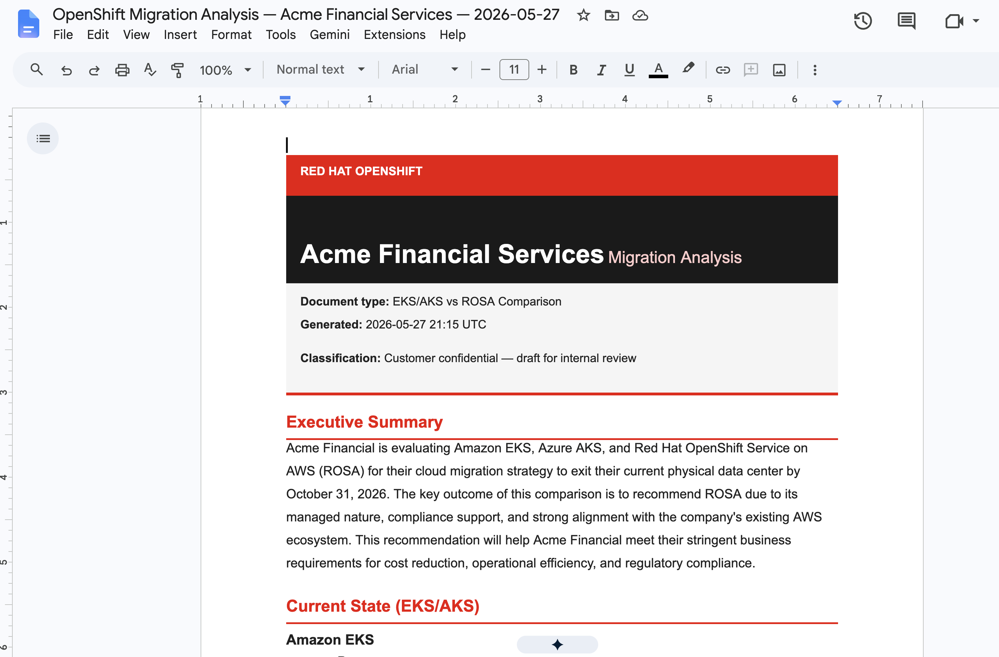

# Solution Architect Agent - Demo Package

**Purpose:** AI-powered OpenShift architecture workflows for Solution Architects on ROSA HCP.

---

## What It Does

An **n8n workflow** that turns discovery notes into complete ROSA proposals using on-cluster AI — **no API keys required**.

| Scenario | Input | Output |
|----------|-------|--------|
| **Pre-Sales** | Discovery notes | ROSA proposal with architecture, costs, timeline |
| **Post-Sales** | "Optimize my cluster" | Live cluster audit via MCP |
| **Competitive** | EKS/AKS setup | ROSA comparison + migration plan |

---

## Performance: use GPU for demos

For **faster chat responses and exports**, run Ollama on a **GPU worker pool**. CPU works for smoke tests but long proposals (1200+ words) can take many minutes per turn.

### Reference environment (validated on ROSA)

| Component | Specification |
|-----------|----------------|
| Platform | ROSA HCP |
| GPU machine pool | AWS **`g4dn.xlarge`** (1× **NVIDIA T4**, 16 GB VRAM) |
| GPU operator | [NVIDIA GPU Operator](https://docs.nvidia.com/datacenter/cloud-native/gpu-operator/latest/openshift/olm-install.html) — `ClusterPolicy` Ready |
| Ollama deploy | `./scripts/setup-ollama-rosa.sh --gpu` → `deploy/07-ollama.yaml` (GPU section) |
| Ollama pod | `namespace: n8n`, `OLLAMA_NUM_CTX=8192`, `nvidia.com/gpu: 1` |
| Model | **`qwen2.5:14b`** (~9 GB download) — set in workflow + `setup-ollama-rosa.sh` |
| n8n workflow | `03-solution-architect-ollama-with-export.json` (Ollama + MCP + Google Drive) |

### Rough response times (same prompts, `demo-scripts/test-inputs/scenario1-short.txt`)

| Compute | Model | Typical full proposal |
|---------|--------|------------------------|
| **GPU** (g4dn.xlarge / T4) | `qwen2.5:14b` | **~2–4 min** per chat turn |
| CPU (default manifest) | `qwen2.5:7b` / `14b` | **~5–15+ min** (14b on CPU is often impractical) |

Scenario **2** (MCP cluster inspection) adds tool-call rounds — budget extra time on top of the table above.

GPU machine pool setup (including spot `g4dn.xlarge`): [Red Hat — Ollama and Open WebUI on ROSA with GPUs](https://cloud.redhat.com/experts/ai-ml/ollama-openwebui/).

```bash
./scripts/setup-ollama-rosa.sh --gpu   # after GPU pool + GPU Operator are ready
oc get nodes -l nvidia.com/gpu.present=true
oc exec -n n8n deploy/ollama -- ollama list
```

---

## Screenshots

**n8n workflow** (`03-solution-architect-ollama-with-export.json`) — Scenario Router, Ollama, MCP, styled Google Doc upload:



**Google Doc output** — Scenario 1 (pre-sales proposal) after HTML import:



---

## Quick Start (ROSA HCP)

```bash
# 1. Deploy n8n + MCP server (+ MCP RBAC)
./deploy/deploy-to-rosa-hcp.sh
./deploy/install-mcp-operator.sh

# 2. Deploy Ollama in namespace n8n (this repo)
# ./scripts/setup-ollama-rosa.sh        # CPU (slow for long proposals)
./scripts/setup-ollama-rosa.sh --gpu    # recommended — see Performance section

# For GPU machine pools, NVIDIA GPU Operator, and Open WebUI on ROSA, see:
# https://cloud.redhat.com/experts/ai-ml/ollama-openwebui/

# 3. Import workflow in n8n UI and Publish
#    workflows/03-solution-architect-ollama-with-export.json  (chat + Google Docs)
#    workflows/02-solution-architect-ollama.json              (chat only)

# 4. Google Drive export (export workflow only) — see below

# 5. Test with demo-scripts/SAMPLE-INPUTS.md
```

---

## Google Drive export (optional)

Used only by `workflows/03-solution-architect-ollama-with-export.json`. This is **Google Drive OAuth2** (create/upload Docs via your Google account). It is **not** the same as [Vertex AI / GCP setup](scripts/setup-vertex-ai.sh) used by `workflows/01-solution-architect-vertexai.json`.

### 1. Google Cloud project and OAuth client

1. Open [Google Cloud Console](https://console.cloud.google.com/) and create or select a project.
2. Enable the API: **APIs & Services → Library** → search **Google Drive API** → **Enable**.  
   ([Drive API library link](https://console.cloud.google.com/apis/library/drive.googleapis.com))
3. Configure the consent screen if prompted: **APIs & Services → OAuth consent screen** (External is fine for demos; add your Google account as a test user while in “Testing”).
4. Create credentials: **APIs & Services → Credentials → Create credentials → OAuth client ID** → type **Web application**.
5. **Authorized redirect URI** must match n8n exactly. In n8n go to **Settings → Credentials → Add credential → Google Drive OAuth2 API** and copy the **OAuth Redirect URL** shown there (typically `https://<your-n8n-host>/rest/oauth2-credential/callback`). Paste that URI into the Google client.
6. Copy **Client ID** and **Client Secret** into the n8n credential, then **Connect** and approve Drive access.

Official references:

- [n8n — Google Drive credentials](https://docs.n8n.io/integrations/builtin/credentials/google/oauth-single-service/)
- [Google — Create OAuth client ID](https://support.google.com/cloud/answer/6158849?hl=en)

**Scopes:** The export workflow uploads HTML as a Google Doc. Use a credential with Drive access (`https://www.googleapis.com/auth/drive.file` is enough for files the app creates; `drive` works if you hit permission errors on folders you own).

### 2. Attach credential in n8n

1. Open workflow **OpenShift Solution Architect (Ollama + Google Docs Export)**.
2. Open node **Upload styled Google Doc**.
3. Select your **Google Drive OAuth2 API** credential (replace `REPLACE_WITH_YOUR_DRIVE_CREDENTIAL_ID` if you re-imported JSON from git).
4. Save and **Publish** the workflow.

### 3. Export folder ID

1. In [Google Drive](https://drive.google.com/), create a folder for proposals (e.g. `ROSA Proposals`).
2. Open the folder. The URL looks like:
   ```text
   https://drive.google.com/drive/folders/1a2b3c4d5e6f7g8h9h0jYourFolderId
   ```
3. Copy the ID after `/folders/` (not the full URL).
4. In n8n, open **Format Proposal for Google Docs** (Code node) and set:
   ```javascript
   const folderId = '1a2b3c4d5e6f7g8h9h0jYourFolderId';
   ```
   Source file: `workflows/ollama-google-doc-formatter.js` (re-import workflow after editing the file in git).

If you leave `REPLACE_WITH_GOOGLE_DRIVE_FOLDER_ID`, uploads still work but land in **My Drive** root.

### 4. Verify

Run a chat in the export workflow. In the execution, open **Upload styled Google Doc** and copy `webViewLink` from the output JSON. The doc should appear in your folder with the styled cover and sections.

---

## Repository Layout

```
deploy/          # n8n, MCP server, Ollama (07-ollama.yaml), MCP RBAC
scripts/         # setup-ollama-rosa.sh
workflows/       # n8n workflow JSON + Code node sources (*.js)
demo-scripts/    # SAMPLE-INPUTS.md (copy-paste demo prompts)
images/          # README screenshots (workflow + sample Google Doc)
```

**Workflow Code node sources** (keep in sync with JSON after edits):

| File | Used in |
|------|---------|
| `workflows/ollama-scenario-router.js` | Scenario Router node |
| `workflows/ollama-google-doc-formatter.js` | Format Proposal for Google Docs node |

---

## How to recreate the demo?

**Yes**, with this repo plus cluster access:

1. Run deploy scripts (`deploy-to-rosa-hcp.sh`, `install-mcp-operator.sh`, `setup-ollama-rosa.sh`).
2. Import the workflow JSON into n8n (Google Drive OAuth + folder ID for the export workflow; see [Google Drive export](#google-drive-export-optional)).
3. Pull `qwen2.5:14b` (or model named in the workflow) on the Ollama pod.
4. Use `demo-scripts/SAMPLE-INPUTS.md` in n8n chat.

Optional: GPU setup following [Red Hat: Ollama and Open WebUI on ROSA](https://cloud.redhat.com/experts/ai-ml/ollama-openwebui/) instead of or in addition to `setup-ollama-rosa.sh`.

---

## Prerequisites

**Cluster & tools**

- ROSA HCP or ARO cluster
- `oc` CLI logged in
- n8n community package: `@n8n/n8n-nodes-langchain` (install via n8n UI after deploy)

**Ollama** — see [Performance: use GPU for demos](#performance-use-gpu-for-demos) for the tested `g4dn.xlarge` / T4 / `qwen2.5:14b` stack. CPU-only is supported but not recommended for live demos.
