# Architecture Diagrams

Visual comparison of the two n8n workflow architectures.

---

## Vertex AI Workflow (No API Keys)

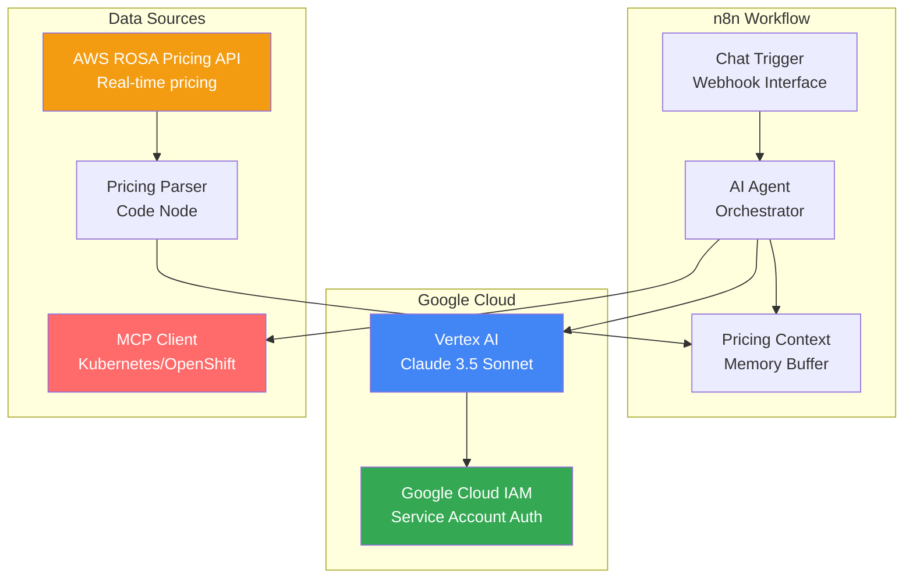

### Key Features:
- ✅ **No API keys** - Uses Google Cloud IAM
- ✅ **Real-time ROSA pricing** - AWS Pricing API integration
- ✅ **Live cluster data** - MCP client for Kubernetes
- ✅ **Pricing context** - Memory buffer with current costs
- ✅ **Claude 3.5 Sonnet** - Best for architecture reasoning

---

## OpenAI Workflow (API Key Auth)

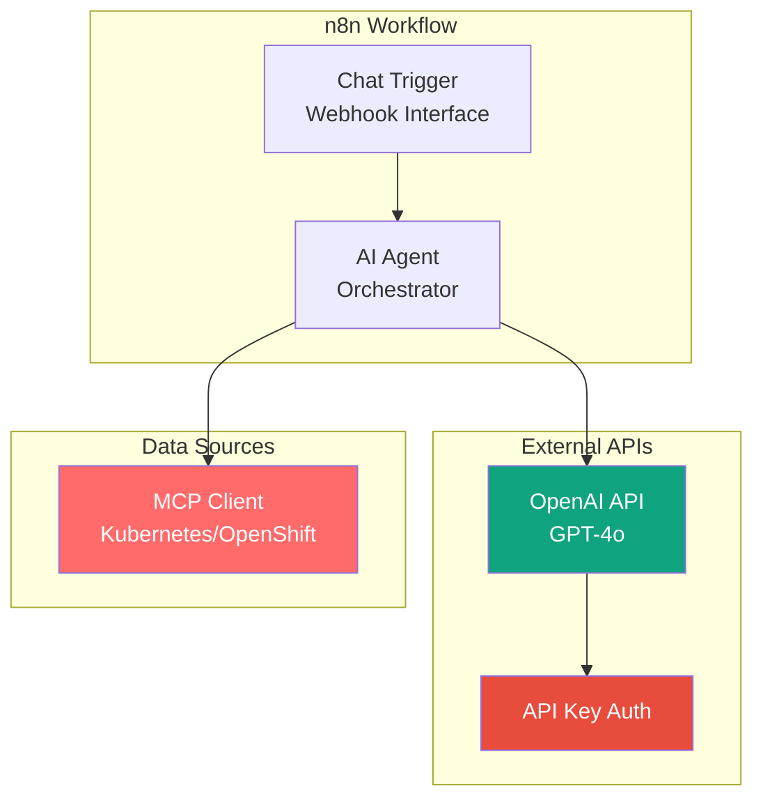

### Key Features:
- ⚡ **Fast setup** - Just paste API key
- ✅ **Live cluster data** - MCP client for Kubernetes
- ✅ **GPT-4o** - Fast and capable
- ❌ **No real-time pricing** - Relies on model knowledge
- ❌ **API key management** - Need to rotate keys

---

## Data Flow Comparison

### Vertex AI: Pre-Sales Discovery Flow

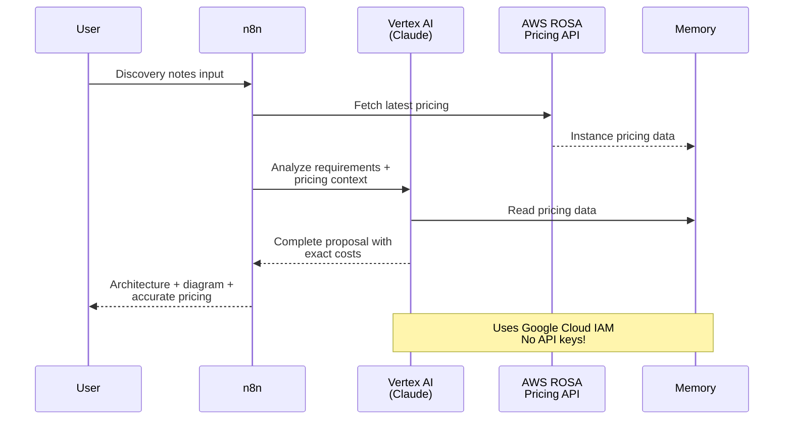

---

### OpenAI: Pre-Sales Discovery Flow

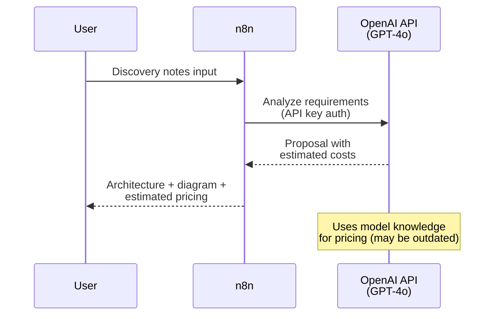

---

## Live Cluster Optimization Flow

**Both workflows use MCP for live cluster data:**

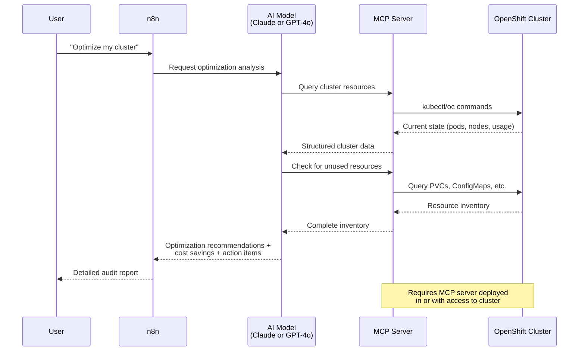

---

## Authentication Comparison

### Vertex AI: Google Cloud IAM

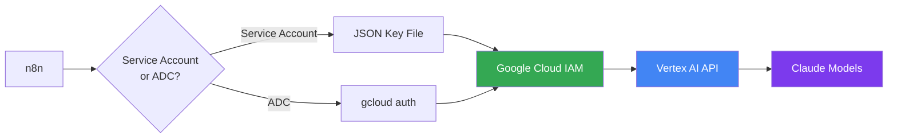

**Benefits:**
- No secrets in n8n database
- Centralized IAM management
- Audit trails in Cloud Logging
- Automatic key rotation (ADC)

---

### OpenAI: API Key

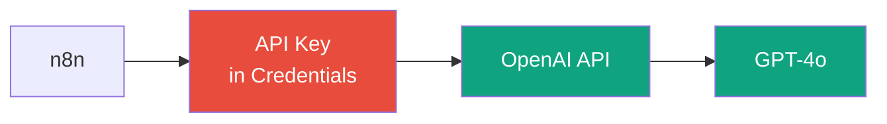

**Considerations:**
- API key stored in n8n database
- Manual key rotation needed
- No built-in audit trail
- Simple setup

---

## Deployment Architectures

### Production Deployment: Vertex AI

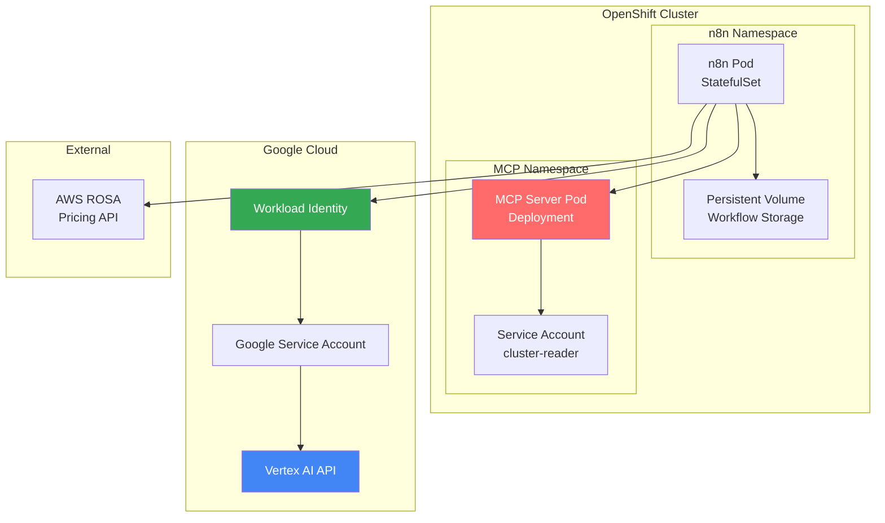

**Features:**
- Workload Identity for seamless auth
- No secrets in pods
- HA with StatefulSet
- Persistent workflow storage

---

### Development Deployment: Docker Compose

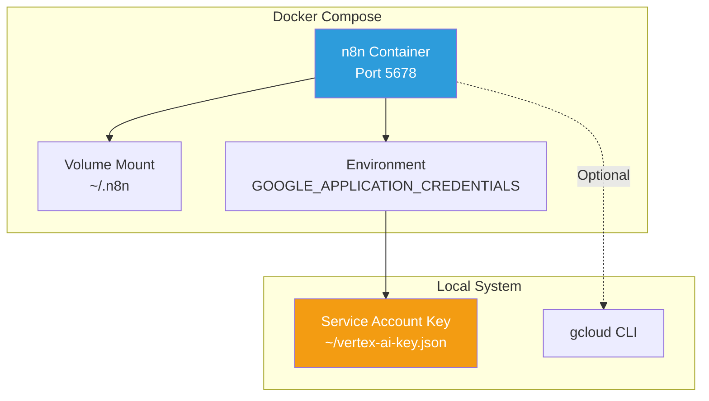

---

## Cost Comparison Architecture

### Vertex AI: Usage-Based + GCP Billing

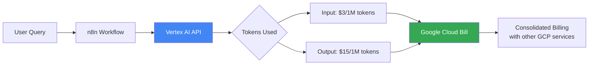

**Typical Cost per Query:**
- Simple query (2K in, 1K out): $0.021
- Complex proposal (10K in, 5K out): $0.12
- **100 queries/month: ~$10-15**

---

### OpenAI: Usage-Based + Separate Billing

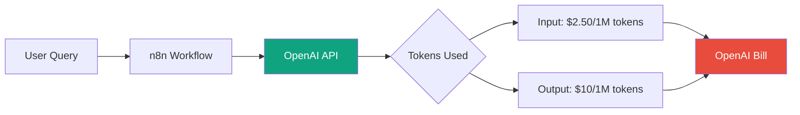

**Typical Cost per Query:**
- Simple query (2K in, 1K out): $0.015
- Complex proposal (10K in, 5K out): $0.09
- **100 queries/month: ~$8-12**

---

## Integration Points

### What Both Workflows Connect To

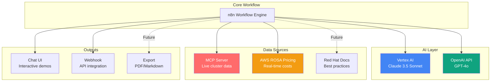

---

## Future Enhancements

### Planned Architecture Additions

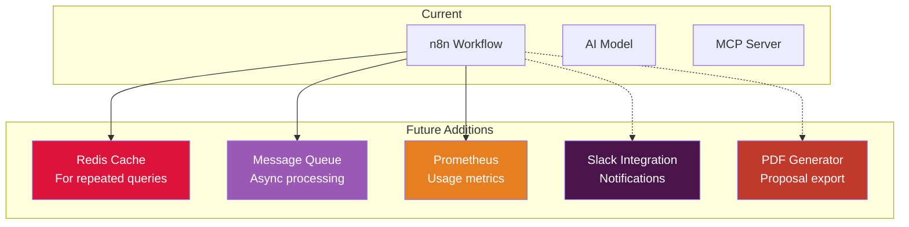

---

## Summary

| Aspect | Vertex AI Workflow | OpenAI Workflow |
|--------|-------------------|-----------------|
| **Complexity** | Medium (5 nodes) | Simple (3 nodes) |
| **Auth Flow** | Google Cloud IAM → Vertex AI | API Key → OpenAI |
| **Data Sources** | MCP + AWS Pricing API | MCP only |
| **Best For** | Production, enterprise | Quick demos, testing |
| **Scalability** | High (GCP quotas) | Medium (OpenAI limits) |
| **Cost Tracking** | GCP billing dashboard | Separate OpenAI dashboard |

**Choose based on:**
- **Your cloud provider:** GCP → Vertex AI, Other → OpenAI
- **Your requirements:** Production → Vertex AI, Demo → OpenAI
- **Your preference:** No API keys → Vertex AI, Simple → OpenAI
